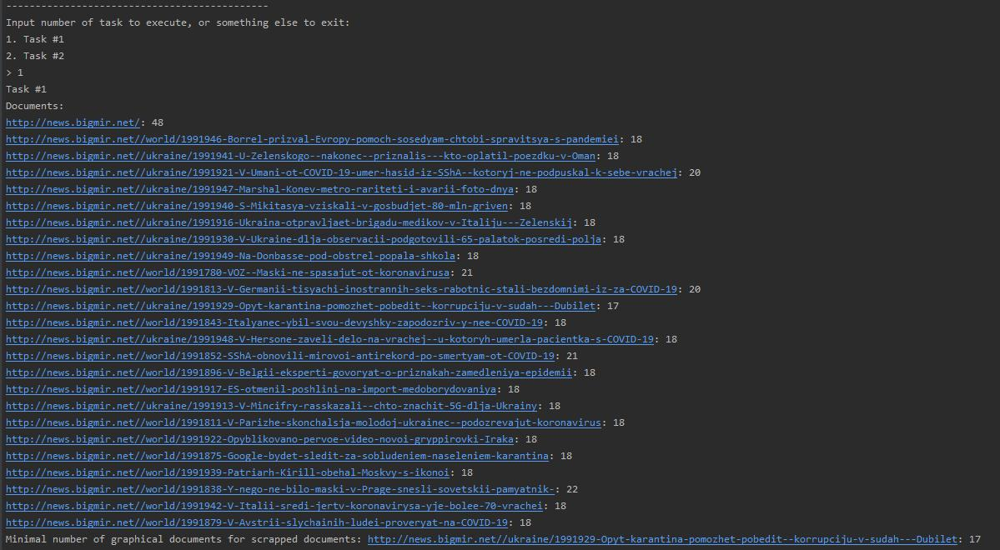
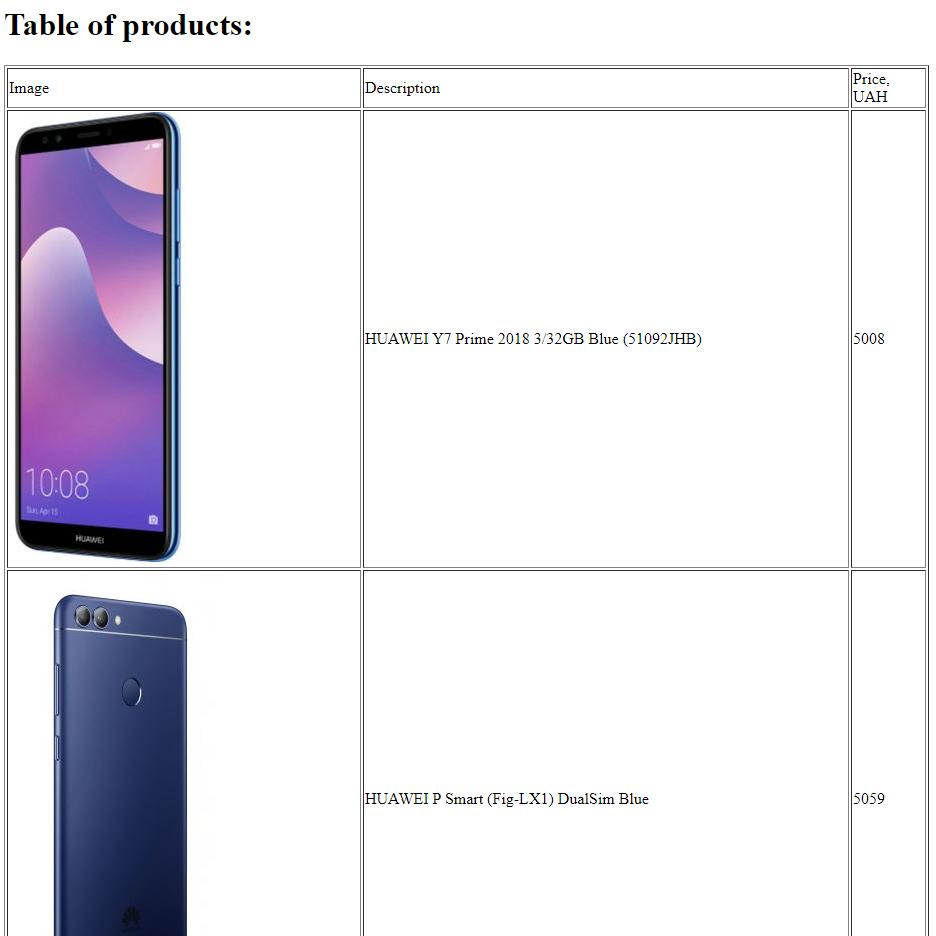

# Лабораторна робота No 1. Вивчення базових операцій обробки XML-документів

## Завдання

[Постановка завдання](docs/lab1_bd2-db2019_2020.docx.pdf)

## Варіант завдання

3 варіант згідно номера у списку групи

| Базова сторінка (завдання 1) | Зміст завдання 2                         | Адреса інтернет-магазину (завдання 3) |
|------------------------------|------------------------------------------|---------------------------------------|
| www.bigmir.net               | Мінімальна кількістьграфічних фрагментів |             www.sokol.ua/             |

## Лістинг коду

### Збирання даних зі сторінки www.bigmir.net  

`src/scrapers/spiders/bigmir.py`

```python
class BigmirSpider(scrapy.Spider):
    name = 'bigmir'
    allowed_domains = ['bigmir.net']
    start_urls = ['http://news.bigmir.net/']

    def parse(self, response: Response):
        all_images = response.xpath("//img/@src[starts-with(., 'http')]")
        all_text = response.xpath(
            "//*[not(self::script)][not(self::style)][string-length(normalize-space(text())) > 30]/text()")
        yield {
            'url': response.url,
            'payload': [{'type': 'text', 'data': text.get().strip()} for text in all_text] +
                       [{'type': 'image', 'data': image.get()} for image in all_images]
        }
        if response.url == self.start_urls[0]:
            all_ukr_links = response.xpath("//a/@href[starts-with(., '/ukraine/')]")
            all_world_links = response.xpath("//a/@href[starts-with(., '/world/')]")
            ukr_selected_links = [link.get() for link in all_ukr_links][:19]
            world_selected_links = [link.get() for link in all_world_links][:19]
            selected_links=ukr_selected_links+world_selected_links
            print(selected_links)
            for link in selected_links:
                yield scrapy.Request("http://news.bigmir.net/"+link, self.parse)

```

### Збирання даних зі сторінки www.sokol.ua

`src/scrapers/spiders/sokol.py`

```python

class SokolSpider(scrapy.Spider):
    name = 'sokol'
    allowed_domains = ['sokol.ua']
    start_urls = ['https://sokol.ua/products/smartfony/?price=5000-&product_list_limit=24']

    def parse(self, response: Response):
        products = response.xpath("//div[contains(@class, 'product details product-item-details')]")[:20]

        for product in products:
            yield {
                'description': product.xpath(".//a[contains(@class,'name')]/text()").get(),
                'img': product.xpath(".//img[contains(@class,'owl-lazy')]/@data-src").get(),
                'price':product.xpath(".//span[contains(@class, 'price-wrapper')]/@data-price-amount").get()

            }

```

### Запис зібраних даних до файлів

`src/scrapers/pipelines.py`

```python

class ScrapersPipeline(object):
    def __init__(self):
        self.root = None

    def open_spider(self, spider):
        self.root = etree.Element("data" if spider.name == "bigmir" else "shop")

    def close_spider(self, spider):
        with open('task%d.xml' % (1 if spider.name == "bigmir" else 2), 'wb') as f:
            f.write(etree.tostring(self.root, encoding="UTF-8", pretty_print=True, xml_declaration=True))

    def process_item(self, item, spider):
        if spider.name == "bigmir":
            page = etree.Element("page", url=item["url"])
            for payload in item["payload"]:
                fragment = etree.Element("fragment", type=payload["type"])
                fragment.text = payload["data"]
                page.append(fragment)
            self.root.append(page)
        else:
            product = etree.Element("product")
            desc = etree.Element("description")
            desc.text = item["description"]
            pr = etree.Element("price")
            pr.text = item["price"]
            img = etree.Element("image")
            img.text = item["img"]
            product.append(desc)
            product.append(pr)
            product.append(img)
            self.root.append(product)
        return item

```

### Завдання №1

`src/main.py`

```python
def task1():
    print("Task #1")
    root = etree.parse("task1.xml")
    pages = root.xpath("//page")
    print("Documents:")
    count = 100000000
    minimal_url=""
    for page in pages:
        url = page.xpath("@url")[0]
        temp_count = page.xpath("count(fragment[@type='image'])")
        if temp_count<count :
            count=temp_count
            minimal_url=url
        print("%s: %d" % (url, temp_count))
    print("Minimal number of graphical documents for scrapped documents: %s: %d" % (minimal_url,count))
```

### Завдання №2

`src/main.py`

```python
def task2():
    print("Task #2")
    transform = etree.XSLT(etree.parse("task2.xsl"))
    result = transform(etree.parse("task2.xml"))
    result.write("task2.xhtml", pretty_print=True, encoding="UTF-8")
    print("XHTML page will be opened in web-browser...")
    webbrowser.open('file://' + os.path.realpath("task2.xhtml"))
```

`src/task2.xsl`

```xml
<?xml version="1.0" encoding="UTF-8"?>
<xsl:stylesheet version="1.0" xmlns:xsl="http://www.w3.org/1999/XSL/Transform" xmlns="http://www.w3.org/1999/xhtml">
    <xsl:output
        method="xml"
        doctype-system="http://www.w3.org/TR/xhtml11/DTD/xhtml11.dtd"
        doctype-public="-//W3C//DTD XHTML 1.1//EN"
        indent="yes"
    />
    <xsl:template match="/">
        <html xml:lang="en">
            <head>
                <title>Task 2</title>
            </head>
            <body>
                <h1>Table of products:</h1>
                <xsl:apply-templates select="/shop"/>
                <xsl:if test="count(/shop/product) = 0">
                    <p>There are no products available</p>
                </xsl:if>
            </body>
        </html>
    </xsl:template>
    <xsl:template match="/shop">
        <table border="1">
            <thead>
                <tr>
                    <td>Image</td>
                    <td>Description</td>
                    <td>Price, UAH</td>
                </tr>
            </thead>
            <tbody>
                <xsl:apply-templates select="/shop/product"/>
            </tbody>
        </table>
    </xsl:template>
    <xsl:template match="/shop/product">
        <tr>
            <td>
                 <xsl:apply-templates select="image"/>
            </td>
            <td>
                <xsl:apply-templates select="description"/>
            </td>
            <td>
                <xsl:apply-templates select="price"/>
            </td>
        </tr>
    </xsl:template>
    <xsl:template match="image">
        
            <xsl:attribute name="src">
                <xsl:value-of select="text()"/>
            </xsl:attribute>
        </img>
    </xsl:template>
    <xsl:template match="price">
        <xsl:value-of select="text()"/>
    </xsl:template>
    <xsl:template match="description">
        <xsl:value-of select="text()"/>
    </xsl:template>
</xsl:stylesheet>
```

## Лістинг згенерованих файлів

### task1.xml

```xml
<?xml version='1.0' encoding='UTF-8'?>
<data>
  <page url="http://news.bigmir.net/">
    <fragment type="text">Новости Украины и мира - последние новости сегодня - bigmir)net</fragment>
    <fragment type="text">Переключиться на мобильную версию</fragment>
    <fragment type="text">Коронавирус в Украине: Обзор главных событий на 2 апреля</fragment>
    <fragment type="text">Коронавирус в Украине: Обзор главных событий на 2 апреля</fragment>
    <fragment type="text">На Яворовском военном полигоне нашли два трупа</fragment>
    <fragment type="text">В Британии рекордное суточное количество смертей от COVID-19</fragment>
    <fragment type="text">Отопление в Киеве начнут отключать к концу недели</fragment>
    <fragment type="text">Тевес: Футболист может прожить шесть месяцев или год без зарплаты</fragment>
    <fragment type="text">Саудовская Аравия хочет обсудить цену на нефть на срочной встрече ОПЕК+</fragment>
    <fragment type="text">Транш на подходе. Когда ждать деньги от МВФ</fragment>
    <fragment type="text">Разумков раскритиковал реакцию СБУ на скандал с братом Ермака</fragment>
    <fragment type="text">За две недели около 10 млн американцев потеряли работу</fragment>
    <fragment type="text">Новенький дорожный McLaren Elva 2020 выпустят в цвете легендарного болида</fragment>
    <fragment type="text">МВД не будет возвращать под обсервацию сбежавших из отеля "Казацкий"</fragment>
    <fragment type="text">Масштабный пожар под Киевом: горела овощебаза</fragment>
    <fragment type="text">Государство поможет выплатить зарплаты работникам малого бизнеса</fragment>
    <fragment type="text">Карантин неоднозначно отразился на экологической ситуации в Украине</fragment>
    <fragment type="text">В Италии больных COVID-19 лечат кровью выздоровевших от инфекции</fragment>
    <fragment type="text">"Доверьтесь флюидам": Экс-супруга Яниса Тиммы выставила фото без белья</fragment>
    <fragment type="text">Алиев: Поднимал руку на бывшую жену, почему нет?</fragment>
    <fragment type="text">Под Парижем на продуктовом складе устроят временный морг</fragment>
    <fragment type="text">Лучшие фильмы про Олимпийские игры, которые в этом году заменят нам Игры в Токио</fragment>
    <fragment type="text">Нардеп Шахов обвинил в пандемии COVID-19 "богатеев из большой семерки"</fragment>
    <fragment type="text">Если РФ уйдет с Донбасса, Госпогранслужба вернет границу за полгода</fragment>
    <fragment type="text">В Китае продолжают есть летучих мышей</fragment>
    <fragment type="text">Легендарный Гаскойн закрутил роман спустя 20 лет одиночества</fragment>
    <fragment type="text">В Запорожской области тюнинговали ГАЗ-2417 в стиле Mad Max</fragment>
    <fragment type="text">"Милота": Кароль с сыном трогательно напомнили о важности карантина</fragment>
    <fragment type="text">Полиция застрелила подростка за "нарушение карантина"</fragment>
    <fragment type="text">Минздрав утвердил единый протокол лечения больных COVID-19 - Степанов</fragment>
    <fragment type="text">Роналду обошел Месси в голосовании за лучшего игрока в истории</fragment>
    <fragment type="text">"Вот такая я Дюймовочка": Екатерина Кухар рассекретила свой рост</fragment>
    <fragment type="text">Убийство украинца в аэропорту Лиссабона: Всплыли новые подробности</fragment>
    <fragment type="text">В Херсонской области от коронавируса скончалась медсестра</fragment>
    <fragment type="text">Государственный центр занятости назвал самые востребованные специальности</fragment>
    <fragment type="text">Путин продлил выходные в России на месяц</fragment>
    <fragment type="text">"Буду улыбаться, несмотря ни на что": Надя Дорофеева поразила признанием</fragment>
    <fragment type="text">Новая диктатура Европы? Борьба Венгрии с вирусом</fragment>
    <fragment type="text">В Австралии начали лабораторные испытания двух вакцин от коронавируса</fragment>
    <fragment type="text">Названы домашние животные, которые пострадают от коронавируса</fragment>
    <fragment type="text">Политика в сфере конфиденциальности и персональных данных</fragment>
    <fragment type="text">Для удобства пользования сайтом используются Cookies.  Подробнее</fragment>
    <fragment type="image">http://bm.img.com.ua/nxs279/berlin/storage/news/300x200/7/c2/84cec966d9bb6fad654151c1953abc27.jpg</fragment>
    <fragment type="image">http://bm.img.com.ua/nxs236/berlin/storage/news/80x60/3/32/e2671b57a585ceaf0d8a00f24b9ef323.jpg</fragment>
    <fragment type="image">http://bm.img.com.ua/nxs234/berlin/storage/news/80x60/4/b8/0751292fb9d0ecf9ec3a277e2f91db84.jpg</fragment>
    <fragment type="image">http://bm.img.com.ua/nxs285/berlin/storage/news/80x60/3/5c/da268c21861fc60442a84c5e8c6355c3.jpg</fragment>
    <fragment type="image">http://bm.img.com.ua/nxs92/berlin/storage/news/80x60/0/bf/dbbe3f6015ecb8b931203b9f9b2cfbf0.jpg</fragment>
    <fragment type="image">http://bm.img.com.ua/nxs56/berlin/storage/news/80x60/a/29/f365f6fe0edcf936cae0ffadb8f2029a.jpg</fragment>
    <fragment type="image">http://bm.img.com.ua/nxs83/berlin/storage/news/80x60/e/68/a4c19b10467bca7cf58ecd44fbca768e.jpg</fragment>
    <fragment type="image">http://bm.img.com.ua/nxs59/berlin/storage/news/80x60/e/d3/e4c2ed2e00b3570e5d34eeb4b31a6d3e.jpg</fragment>
    <fragment type="image">http://bm.img.com.ua/nxs202/berlin/storage/news/80x60/b/82/0015e491f8c990df76d4c7232c5e982b.jpg</fragment>
    <fragment type="image">http://bm.img.com.ua/nxs6/berlin/storage/news/80x60/7/7a/fa06699c5af44f36be8bdb46510167a7.jpg</fragment>
    <fragment type="image">http://bm.img.com.ua/nxs118/berlin/storage/news/80x60/8/be/054b2c5d81477e9a38808b76ef664be8.jpg</fragment>
    <fragment type="image">http://bm.img.com.ua/nxs113/berlin/storage/news/80x60/e/cf/530473240e5d5916d84861efdd8b6cfe.jpg</fragment>
    <fragment type="image">http://bm.img.com.ua/nxs246/berlin/storage/news/80x60/f/e1/2c217437c54941a6d2dd9737915d0e1f.jpg</fragment>
    <fragment type="image">http://bm.img.com.ua/nxs32/berlin/storage/news/300x200/6/27/e2ae5f9511d97e73d9ae87f57b58b276.jpg</fragment>
    <fragment type="image">http://bm.img.com.ua/nxs13/berlin/storage/news/80x60/0/34/63ca5c90324548fd40822d6d9febf340.jpg</fragment>
    <fragment type="image">http://bm.img.com.ua/nxs58/berlin/storage/news/80x60/d/ae/69fa5ea09db0cea7eeb247e45184baed.jpg</fragment>
  </page>
</data>
```

### task2.xml

```xml
<?xml version='1.0' encoding='UTF-8'?>
<shop>
  <product>
    <description>&#13;
                                        HUAWEI Y7 Prime 2018 3/32GB Blue (51092JHB)                                    </description>
    <price>5008</price>
    <image>https://sokol.ua/pub/media/catalog/product/cache/d6b5294e30f45be9d29233c7509553bf/6/9/69041527641306.jpg</image>
  </product>
  <product>
    <description>&#13;
                                        HUAWEI P Smart (Fig-LX1) DualSim Black                                    </description>
    <price>5059</price>
    <image>https://sokol.ua/pub/media/catalog/product/cache/d6b5294e30f45be9d29233c7509553bf/7/6/76281526695011.jpg</image>
  </product>
  <product>
    <description>&#13;
                                        HUAWEI P Smart (Fig-LX1) DualSim Blue                                    </description>
    <price>5059</price>
    <image>https://sokol.ua/pub/media/catalog/product/cache/d6b5294e30f45be9d29233c7509553bf/1/6/16091526695008.jpg</image>
  </product>
  <product>
    <description>&#13;
                                        SAMSUNG SM-J600F Galaxy J6 Duos ZVD lavenda                                    </description>
    <price>5199</price>
    <image>https://sokol.ua/pub/media/catalog/product/cache/d6b5294e30f45be9d29233c7509553bf/3/1/31091531030726.jpg</image>
  </product>
</shop>

```

### task2.xhtml

```xhtml
<!DOCTYPE html PUBLIC "-//W3C//DTD XHTML 1.1//EN" "http://www.w3.org/TR/xhtml11/DTD/xhtml11.dtd">
<html xmlns="http://www.w3.org/1999/xhtml" xml:lang="en">
  <head>
    <title>Task 2</title>
  </head>
  <body>
    <h1>Table of products:</h1>
    <table border="1">
      <thead>
        <tr>
          <td>Image</td>
          <td>Description</td>
          <td>Price, UAH</td>
        </tr>
      </thead>
      <tbody>
        <tr>
          <td>
            
          </td>
          <td>&#13;
                                        HUAWEI Y7 Prime 2018 3/32GB Blue (51092JHB)                                    </td>
          <td>5008</td>
        </tr>
        <tr>
          <td>
            
          </td>
          <td>&#13;
                                        HUAWEI P Smart (Fig-LX1) DualSim Blue                                    </td>
          <td>5059</td>
        </tr>
        <tr>
          <td>
            
          </td>
          <td>&#13;
                                        HUAWEI P Smart (Fig-LX1) DualSim Black                                    </td>
          <td>5059</td>
        </tr>
        <tr>
          <td>
            
          </td>
          <td>&#13;
                                        SAMSUNG SM-J600F Galaxy J6 Duos ZKD black                                    </td>
          <td>5199</td>
        </tr>
        <tr>
          <td>
            
          </td>
          <td>&#13;
                                        SAMSUNG SM-J600F Galaxy J6 Duos ZVD lavenda                                    </td>
          <td>5199</td>
        </tr>
      </tbody>
    </table>
  </body>
</html>

```

## Приклади роботи програми






